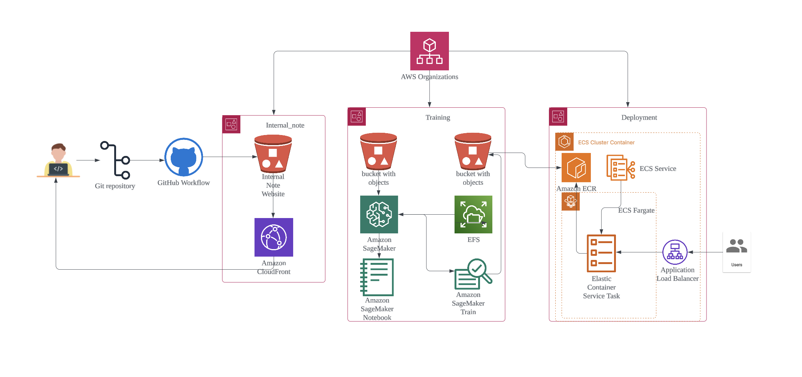

# Overall Architecture

[🔗 View Full Diagram](https://lucid.app/lucidchart/893d2023-3eee-4ff0-876d-4c7cd5a2da27/view?page=0_0#)

## 🔹 System Components
This architecture supports an **AI model training and deployment pipeline** on AWS.

### **1️⃣ GitHub & CI/CD Workflow**
- Developers push code to a **Git repository**.
- **GitHub Actions** triggers workflows for automated builds.

### **2️⃣ Data Storage & Training**
- **Amazon S3** stores training data and model artifacts.
- **Amazon SageMaker** handles model training and notebook-based experimentation.
- **EFS** is used for persistent storage across training jobs.

### **3️⃣ Model Deployment to ECS**
- **Trained models** are stored in S3.
- The latest model is deployed to **Amazon ECS (Fargate)**.
- **Amazon ECR** stores the containerized inference service.
- **Application Load Balancer** routes traffic to the ECS task.

## 📌 **Automated Deployment Workflow**
1️⃣ A **new model is uploaded** to the S3 bucket (`sagemaker-shared-models`).  
2️⃣ **EventBridge detects the update** and triggers a Lambda function.  
3️⃣ **Lambda forces ECS to redeploy** the latest inference model.  

### 🛠 **Key AWS Services Used**
| Service | Purpose |
|---------|---------|
| **GitHub Actions** | CI/CD automation |
| **Amazon S3** | Data & model storage |
| **Amazon SageMaker** | Model training |
| **ECS Fargate** | Serverless container deployment |
| **Application Load Balancer** | Manages inference requests |

---

# 📌 How This Documentation is Managed

## **Automated Internal Note Deployment Workflow**
1️⃣ **New documentation updates** are pushed to the repository (`main` branch).  
2️⃣ **GitHub Actions detects the update** and triggers a deployment workflow.  
3️⃣ **The updated site is synchronized** with an **S3 bucket** used for internal documentation.  
4️⃣ **CloudFront serves the latest content**, ensuring access via a secure CDN.  

## **Security & Access Control**
1️⃣ The S3 bucket is **private** and only accessible via CloudFront.

2️⃣ Authentication is managed using **GitHub OIDC**, eliminating the need for static AWS credentials.

3️⃣ CloudFront **caching ensures fast updates** while keeping costs low.