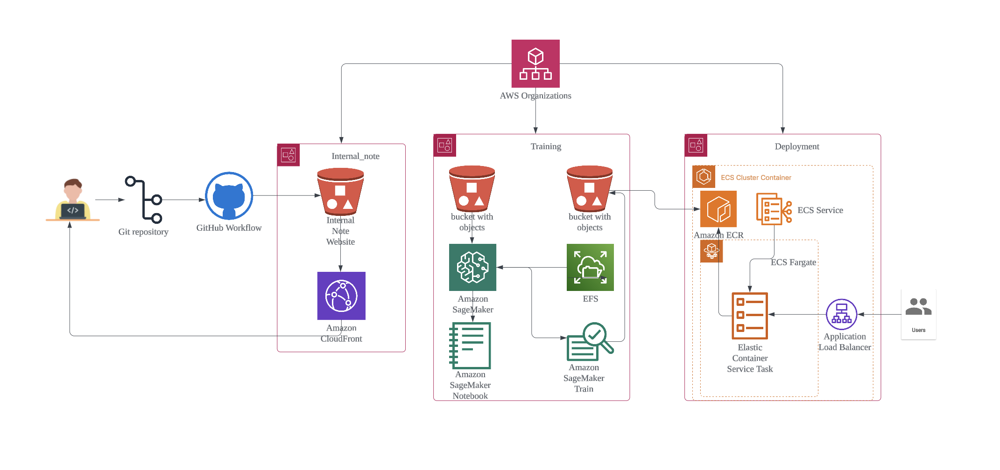

# 🌐 Cloud Architecture Team Documentation

Welcome to the Cloud Architecture team's documentation section. Here you'll find all documentation related to our **infrastructure and deployment processes**.

## 📌 Table of Contents

### **1️⃣ AWS Infrastructure**
- [AWS Architecture Overview](AWS%20Architecture.md)
- [AWS Setup for AWS Organization and IAM Identity Center](AWS%20Setup%20for%20AWS%20Organization%20and%20IAM%20Identity%20Center.md)

### **2️⃣ Training**
- [AWS Setup for Training](AWS%20Setup%20for%20Training.md)

### **3️⃣ Automated Deployment**
- [AWS Set Up for Auto Deployment ECS Service](AWS%20Set%20Up%20for%20Auto%20Deployment%20ECS%20Service.md)
- [AWS Setup for Deployment V1](AWS%20Setup%20for%20Deployment%20V1.md)
- [AWS Frontend to Backend ](AWS%20Frontend%20to%20Backend.md)

### **4️⃣ Internal Documentation**
- [AWS Setup for Internal Documentation](AWS%20Setup%20for%20Internal%20Documentation.md)

## 📌 **Architecture Diagram**

